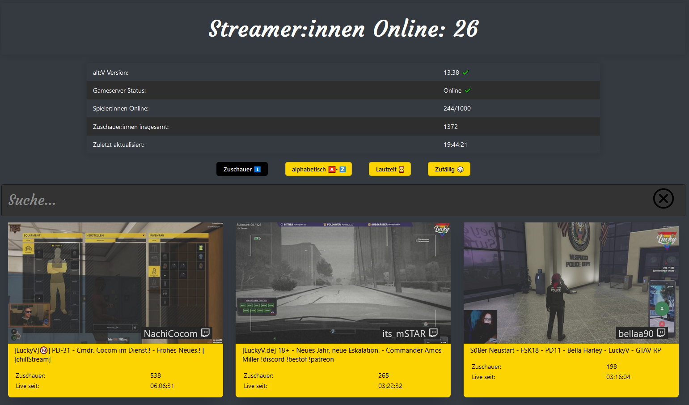
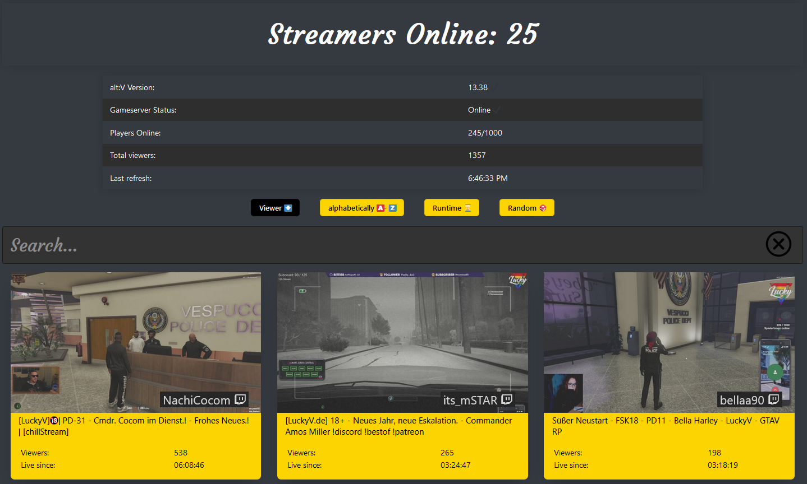
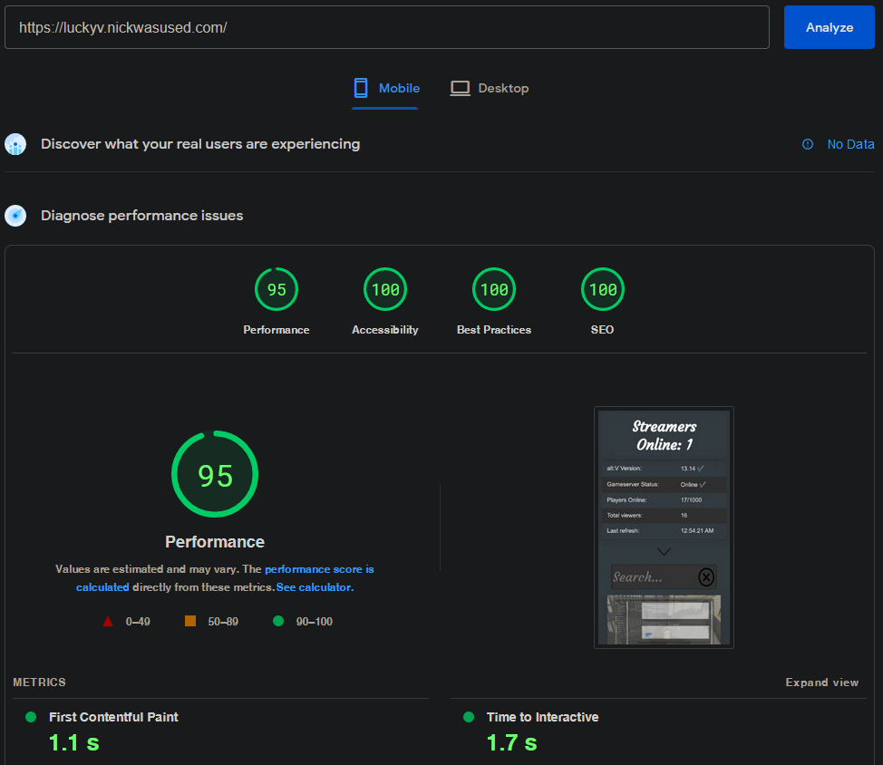

# Using

-   [Vue.js (Vue 3)](https://vuejs.org/), "An approachable, performant and versatile framework for building web user interfaces."
-   [Twitch Search Server](https://github.com/Nickwasused/twitch-search-server), a custom Search for Twitch.

# Features

-   PWA ([Progressive web application](https://wikiless.org/wiki/Progressive_web_application))
-   SPA ([Single-page application](https://wikiless.org/wiki/single_page_application))
-   SASS ([Syntactically Awesome Style Sheets](https://sass-lang.com/))
-   Automatic refresh (alt:V, Twitch)
-   Lazy loading images with ([Intersection Observer](https://developer.mozilla.org/en-US/docs/Web/API/Intersection_Observer_API))
-   Fast Builds (~12 seconds on Vercel)
-   Small Builds (0.28 MB, with external Font)
-   Caching API data in localstorage
-   Multi language support (Currently German and English) with Automatic detection.
-   Sort streams by Viewer count, Alphabetically, runtime or randomize the list.
-   Search streams by title or Username.
-   Show the status of the game server, e.g. if the server is online.
-   Tooltips to describe values.

# Preview

# Building and development

0. Make sure that you have [node 16+](https://nodejs.org/en/) installed with [PNPM](https://www.npmjs.com/package/pnpm)
1. Start by cloning the repository: `git clone https://github.com/Nickwasused/streaming-list.git`
2. Change into the directory and open a shell of some sort e.g. PowerShell, bash
3. install the dependencies with: `pnpm i`
4. now you can start developing with: `pnpm run dev`

You can get started by editing the .env file

# Speed

## mobile

## desktop

